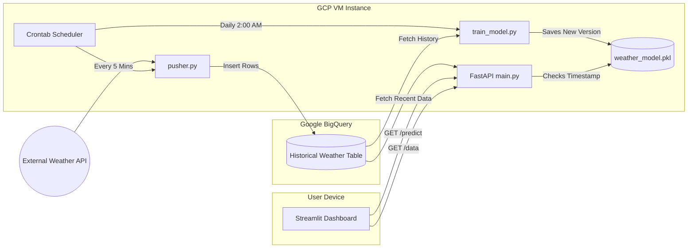

# 🌦️ Full-Stack Real-Time Weather AI Pipeline

An automated, end-to-end Machine Learning ecosystem hosted on Google Cloud Platform. This system integrates a live data ingestion pipeline, a self-updating AI model, and a web-based dashboard for real-time visualization and forecasting.

## 🏗️ Project Architecture & Data Flow

### 1. Frontend (Visualization)

- **App:** `streamlit_real_weather.py`
- **Tech:** **Streamlit**, Plotly, Pandas
- **Function:** A real-time dashboard that fetches data and predictions from the FastAPI backend. It provides interactive charts for temperature trends and compares current metrics against AI-generated forecasts.

### 2. Backend API (Inference)

- **Engine:** **FastAPI** (`main.py`)
- **Smart Logic:** Implements a **Hot-Swap** model loader. The API monitors the model's file timestamp (`mtime`). When the daily retraining completes, the API automatically reloads the new weights into memory without needing a server restart.
- **Endpoints:** - `GET /predict`: Returns the next-hour temperature forecast.
  - `GET /data`: Fetches the most recent logs from BigQuery for UI display.

### 3. Data Pipeline & ETL

- **Ingestion (The "Pusher"):** `pusher.py` fetches live weather metrics every 5 minutes from external APIs and streams them into **Google BigQuery**.
- **Continuous Training:** `train_model.py` pulls historical data from BigQuery every night to retrain the Scikit-Learn regressor, ensuring the model adapts to recent data patterns.

---

## ⚙️ GCP Infrastructure Details

The system is deployed on **Google Cloud Compute Engine**.

| Component        | Specification                                                       |
| :--------------- | :------------------------------------------------------------------ |
| **VM Instance**  | `e2-micro` (Debian GNU/Linux 12)                                    |
| **Database**     | **Google BigQuery** (Time-series data warehouse)                    |
| **Networking**   | Port `8000` (API) and Port `8501` (Streamlit) open via GCP Firewall |
| **IAM Security** | Authenticated via Service Account JSON (BigQuery Data Editor role)  |

---

## 🛠️ Setup & Deployment

### 1. Installation

```bash
git clone [https://github.com/your-username/weather-station.git](https://github.com/your-username/weather-station.git)
cd weather-station
python3 -m venv venv
source venv/bin/activate
pip install -r requirements.txt
```


